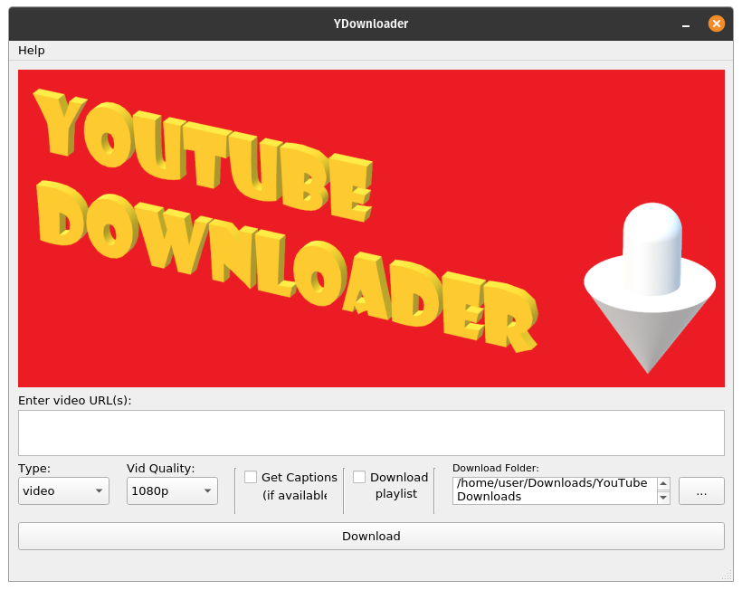

# YDownloader (beta)

YDownloader provides an easy GUI for downloading youtube videos of preferred quality directly into your machine, through the help you youtube-dl. It allows you download full playlist, audio and captions from youtube and also lets you enter multiple video links to download them all at once.

**To get started simply download the executable and run.**

Or clone the repo and run:
 
    python -m pip install requirements.txt
    python main.py

## Requirements

**Requires ffmpeg installed**.
  On debian-based linux distributions this can be simply done using:

    sudo apt install ffmpeg

**As of right now, downloding playlist feature requires you to manually obtain and provide youtube-api key to the application. This can be obtained through google developer's console.
 After obtaining it create a file 'key.txt' with the api key written on it's fist line and add it to the same folder as the application.**

## TODO
1. Request Youtube API Key through a dialog box.
2. Show a downloading dialogue/messge.
3. Figure out how to directly download into downloads folder, insted of moving the downloads into it.
4. Figure out what goes wrong while downloading certain videos like:
    https://www.youtube.com/watch?v=7ua3g6NKvHY
5. Eventually, make it possible to properly download playlist without youtube api key.
